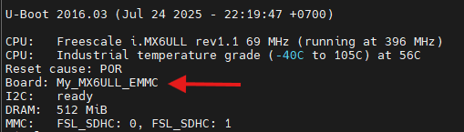

# Copy files
1. Extract and Rename U-Boot Source
    ```bash
    mkdir my_uboot-imx-rel_imx_4.1.15_2.1.0_ga \
    tar -xf uboot-imx-rel_imx_4.1.15_2.1.0_ga.tar.bz2 -C my_uboot-imx-rel_imx_4.1.15_2.1.0_ga \
    cd my_uboot-imx-rel_imx_4.1.15_2.1.0_ga
    ```
2. Copy and Rename Defconfig
    ```bash
    cp configs/mx6ull_14x14_evk_emmc_defconfig /configs/my_mx6ull_emmc_defconfig
    ```
    Why `mx6ull_14x14_evk_emmc_defconfig` ?  
    -> Because the dev kit uses eMMC as the main flash memory. If your board has different hardware requirements, choose the corresponding defconfig.
3. Copy and Rename Header File
    ```bash
    cp include/configs/mx6ullevk.h include/configs/my_mx6ull_emmc.h
    ```
4. Copy and Rename Board Folder
    ```bash
    cp board/freescale/mx6ullevk/ -r board/freescale/my_mx6ull_emmc
    mv board/freescale/my_mx6ull_emmc/mx6ullevk.c board/freescale/my_mx6ull_emmc/my_mx6ull_emmc.c
    ```
5. Created Files:
    - /configs/my_mx6ull_emmc_defconfig
    - /include/configs/my_mx6ull_emmc.h
    - /board/freescale/my_mx6ull_emmc/ (directory)
    - /board/freescale/my_mx6ull_emmc/my_mx6ull_emmc.c

# Edit files
1. In `my_mx6ull_emmc_defconfig` change board folder path and target to
    ```diff
    - CONFIG_SYS_EXTRA_OPTIONS="IMX_CONFIG=board/freescale/mx6ullevk/imximage.cfg,MX6ULL_EVK_EMMC_REWORK"
    + CONFIG_SYS_EXTRA_OPTIONS= "IMX_CONFIG=board/freescale/my_mx6ull_emmc/imximage.cfg,MX6ULL_EVK_EMMC_REWORK"
    
    - CONFIG_TARGET_MX6ULL_14X14_EVK=y
    + CONFIG_TARGET_MY_MX6ULL_EMMC=y
    ```
2. In `my_mx6ull_emmc.h`
    ```diff
    - #ifndef __MX6ULLEVK_CONFIG_H
    - #define __MX6ULLEVK_CONFIG_H
    + #ifndef __MY_MX6ULL_EMMC_H
    + #define __MY_MX6ULL_EMMC_H
    ```
3. In `my_mx6ull_emmc` directory
    - `my_mx6ull_emmc.c`
        ```diff
        int checkboard(void)
        {
            if (is_mx6ull_9x9_evk())
                puts("Board: MX6ULL 9x9 EVK\n");
            else
        -       puts("Board: MX6ULL 14x14 EVK\n");
        +       puts("Board: My_MX6ULL_EMMC\n");
            return 0;
        }
        ```
        Changing text will reflect on Serial console.
        <p>
        
        </p>

    - `Makefile`
        ```diff
        - obj-y  := mx6ullevk.o
        + obj-y  := my_mx6ull_emmc.o
        ```
    - `imximage.cfg`
        ```diff
        - PLUGIN	board/freescale/mx6ullevk/plugin.bin 0x00907000
        + PLUGIN	board/freescale/my_mx6ull_emmc/plugin.bin 0x00907000
        ```
    - `Kconfig`
        ```diff
        - if TARGET_MX6ULL_14X14_EVK || TARGET_MX6ULL_9X9_EVK
        + if TARGET_MY_MX6ULL_EMMC

        - config SYS_BOARD
	    -   default "mx6ullevk"
        + config SYS_BOARD
        +   default "my_mx6ull_emmc"

        + config SYS_SOC
        +   default "mx6"

        - config SYS_CONFIG_NAME
	    -   default "mx6ullevk"
        + config SYS_CONFIG_NAME
        +   default "my_mx6ull_emmc"
        ```
    - `MAINTAINERS` change whole file (optional)
        ```make
        MY_MX6ULL_EMMC BOARD
        M. Dang Vi Tin <dangvitin@gmail.com>
        S. Maintained
        F. board/freescale/my_mx6ull_emmc/
        F. include/configs/my_mx6ull_emmc.h
        ```
4. In `/arch/arm/cpu/armv7/mx6/` directory
    - `Kconfig`
        ```diff
        + config TARGET_MY_MX6ULL_EMMC
        +   bool "Support my_mx6ull_emmc"
        +   select MX6ULL
        +   select DM
        +   select DM_THERMAL

        + source "board/freescale/my_mx6ull_emmc/Kconfig"
        ```

# Build
1. Using command line
    ```bash
    make ARCH=arm CROSS_COMPILE=../../../1_toolchain/gcc-linaro-4.9.4-2017.01-x86_64_arm-linux-gnueabihf/bin/arm-linux-gnueabihf- my_mx6ull_emmc_defconfig
    make ARCH=arm CROSS_COMPILE=../../../1_toolchain/gcc-linaro-4.9.4-2017.01-x86_64_arm-linux-gnueabihf/bin/arm-linux-gnueabihf- -j12
    ```
2. Using script file
    - Copy script file to u-boot folder
        ```bash
        cp ../build.sh .
        ```
    - Build
        ```bash
        ./build.sh
        ```
    - Clean build
        ```bash
        ./build.sh -clean
        ```
# Flash to emmc using uuu tool
1. Install uuu tool
    ```bash
    sudo apt install uuu
    ```
2. Connect dev kit usb port to PC
    - Check connected device
        ```bash
        uuu -lsusb
        ```
    - Download the `u-boot.imx` output file from the U-Boot root folder.
        ```bash
        uuu -b spl u-boot.imx
        ```