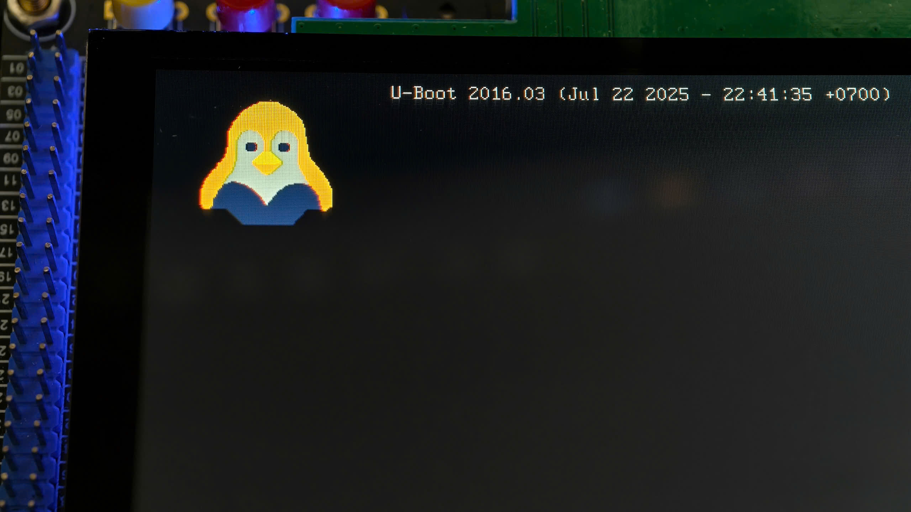

# Add files (u-boot root folder)
1. Create an image with dimensions that are multiples of 8 (e.g., 160 × 160). Use a simple color mode (8-bit, 256 colors), and avoid using white in the image.

<p align="center">
  
</p>

2. Save the bitmap (.bmp) file in the tools/logos/ directory, using your board's name. In this example, it is named ``my_mx6ull_emmc.bmp`` and must folow the board name.

<p align="center">
  
</p>

# Build
1. Using command line
    ```bash
    make ARCH=arm CROSS_COMPILE=../../../1_toolchain/gcc-linaro-4.9.4-2017.01-x86_64_arm-linux-gnueabihf/bin/arm-linux-gnueabihf- my_mx6ull_emmc_defconfig
    make ARCH=arm CROSS_COMPILE=../../../1_toolchain/gcc-linaro-4.9.4-2017.01-x86_64_arm-linux-gnueabihf/bin/arm-linux-gnueabihf- -j12
    ```
2. Using script file
    - Copy script file to u-boot folder
        ```bash
        cp ../build.sh .
        ```
    - Build
        ```bash
        ./build.sh
        ```
    - Clean build
        ```bash
        ./build.sh -clean
        ```
# Flash to emmc using uuu tool
1. Install uuu tool
    ```bash
    sudo apt install uuu
    ```
2. Connect dev kit usb port to PC
    - Check connected device
        ```bash
        uuu -lsusb
        ```
    - Download the `u-boot.imx` output file from the U-Boot root folder.
        ```bash
        uuu -b spl u-boot.imx
        ```