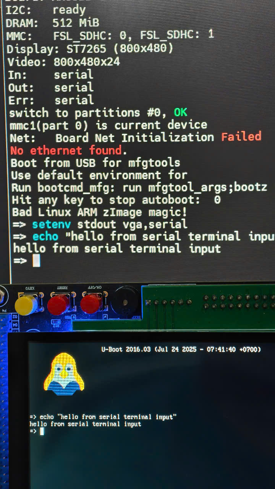

# Connect u-boot console
1. Use USB TTL (USB Serial) to connect to your board, default baudrate is 115200.

2. Type `coninfo` to show console output and input device

    ```
    => coninfo
    List of available devices:
    vga      00000002 .O
    serial   00000003 IO stdin stdout stderr
    nulldev  00000003 IO
    mxc_serial 00000003 IO
    ```
    The command show that serial have `IO` that mean serial can handle both output and input. The vga only have `O` that mean it can only handle output.

3. Type `setenv stdout vga` to show console on LCD, now console will not showing on serial terminal anymore but still take input and show on LCD.

4. To show console on both serial terminal and LCD. In `/include/configs/my_mx6ull_emmc.h` add line `#define CONFIG_CONSOLE_MUX`
    ```diff
    #define CONFIG_VIDEO_BMP_LOGO
    #define CONFIG_IMX_VIDEO_SKIP
    + #define CONFIG_CONSOLE_MUX
    #endif
    #endif
    ```
    Rebuild, when booting to serial console, type `setenv stdout vga,serial` to output on both LCD and Serial terminal.

    <p align="center">
      
    </p>
# Build
1. Using command line
    ```bash
    make ARCH=arm CROSS_COMPILE=../../../1_toolchain/gcc-linaro-4.9.4-2017.01-x86_64_arm-linux-gnueabihf/bin/arm-linux-gnueabihf- my_mx6ull_emmc_defconfig
    make ARCH=arm CROSS_COMPILE=../../../1_toolchain/gcc-linaro-4.9.4-2017.01-x86_64_arm-linux-gnueabihf/bin/arm-linux-gnueabihf- -j12
    ```
2. Using script file
    - Copy script file to u-boot folder
        ```bash
        cp ../build.sh .
        ```
    - Build
        ```bash
        ./build.sh
        ```
    - Clean build
        ```bash
        ./build.sh -clean
        ```
# Flash to emmc using uuu tool
1. Install uuu tool
    ```bash
    sudo apt install uuu
    ```
2. Connect dev kit usb port to PC
    - Check connected device
        ```bash
        uuu -lsusb
        ```
    - Download the `u-boot.imx` output file from the U-Boot root folder.
        ```bash
        uuu -b spl u-boot.imx
        ```