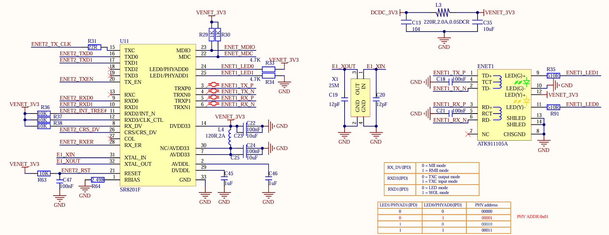

# Ethernet device
1. On our board only ENET2 is used and the current ethernet chip this tutorial using is SR8201F, which have similar pinout to KSZ8081 on NXP I.MX6ULL EVK board, only the reset pin is connect differently.

    <p align="center">
      
    </p>

2. Check ethernet configs in `my_mx6ull_emmc.h`
    ```c
    /* Ethernet Configs */
    #ifdef CONFIG_CMD_NET
    #define CONFIG_CMD_PING
    #define CONFIG_CMD_DHCP
    #define CONFIG_CMD_MII
    #define CONFIG_FEC_MXC
    #define CONFIG_MII
    #define CONFIG_FEC_ENET_DEV		1

    #if (CONFIG_FEC_ENET_DEV == 0)
    #define IMX_FEC_BASE			ENET_BASE_ADDR
    #define CONFIG_FEC_MXC_PHYADDR          0x2
    #define CONFIG_FEC_XCV_TYPE             RMII
    #elif (CONFIG_FEC_ENET_DEV == 1)
    #define IMX_FEC_BASE			ENET2_BASE_ADDR
    #define CONFIG_FEC_MXC_PHYADDR		0x1
    #define CONFIG_FEC_XCV_TYPE		RMII
    #endif
    #define CONFIG_ETHPRIME			"FEC"

    #define CONFIG_PHYLIB
    #define CONFIG_PHY_MICREL
    #endif
    ```
    `CONFIG_FEC_MXC_PHYADDR` is PHY address, with ENET1 it is 0x2 and ENET2 is 0x1.

    `CONFIG_FEC_ENET_DEV` is which device we will use in u-boot.

    Since we use ENET2, `CONFIG_FEC_ENET_DEV` = 1 and `CONFIG_FEC_MXC_PHYADDR` = 1 is correct.

    `CONFIG_PHY_MICREL` is which driver to used, the NXP I.MX6ULL EVK board used KSZ8081 made by Micrel, so we need to change this line to our chip, the SR8201F, which use the REALTEK driver.

    ```diff
    #define CONFIG_PHYLIB
    - #define CONFIG_PHY_MICREL
    + #define CONFIG_PHY_REALTEK
    #endif
    ```

3. By default, the NXP i.MX6ULL EVK uses a 74LV595 shift register to expand GPIO capabilities, controlling the RESET pins of both network interfaces. In contrast, our development kit directly controls the network interfaces without using the 74LV595.

    In `my_mx6ull_emmc.c`

    Delete GPIO expander define
    ```diff
    + #define ENET1_RESET IMX_GPIO_NR(5, 7)
    + #define ENET2_RESET IMX_GPIO_NR(5, 8)

    - #define IOX_SDI IMX_GPIO_NR(5, 10)
    - #define IOX_STCP IMX_GPIO_NR(5, 7)
    - #define IOX_SHCP IMX_GPIO_NR(5, 11)
    - #define IOX_OE IMX_GPIO_NR(5, 8)

    - static iomux_v3_cfg_t const iox_pads[] = {
    - /* IOX_SDI */
    - MX6_PAD_BOOT_MODE0__GPIO5_IO10 | MUX_PAD_CTRL(NO_PAD_CTRL),
    - /* IOX_SHCP */
    - MX6_PAD_BOOT_MODE1__GPIO5_IO11 | MUX_PAD_CTRL(NO_PAD_CTRL),
    - /* IOX_STCP */
    - MX6_PAD_SNVS_TAMPER7__GPIO5_IO07 | MUX_PAD_CTRL(NO_PAD_CTRL),
    - /* IOX_nOE */
    - MX6_PAD_SNVS_TAMPER8__GPIO5_IO08 | MUX_PAD_CTRL(NO_PAD_CTRL),
    - };
    ```

    Delete 2 functions related to 74LV595
    ```diff
    - static void iox74lv_init(void)

    ...

    - void iox74lv_set(int index)
    
    ...

    int board_init(void)
    {
        /* Address of boot parameters */
        gd->bd->bi_boot_params = PHYS_SDRAM + 0x100;

    -   imx_iomux_v3_setup_multiple_pads(iox_pads, ARRAY_SIZE(iox_pads));

    -   iox74lv_init();

    ...
    }
    ```
    Add reset sequence
    ```diff
    static void setup_iomux_fec(int fec_id)
    {
        if (fec_id == 0)
    +   {
            imx_iomux_v3_setup_multiple_pads(fec1_pads,
                            ARRAY_SIZE(fec1_pads));

    +       gpio_direction_output(ENET1_RESET, 1);
    +       gpio_set_value(ENET1_RESET, 0);
    +       mdelay(20);
    +       gpio_set_value(ENET1_RESET, 1);
    +   }
        else
    +   {
            imx_iomux_v3_setup_multiple_pads(fec2_pads,
                            ARRAY_SIZE(fec2_pads));
    +       gpio_direction_output(ENET2_RESET, 1);
    +       gpio_set_value(ENET2_RESET, 0);
    +       mdelay(20);
    +       gpio_set_value(ENET2_RESET, 1);
    +   }

    +   mdelay(150); /* Delay at least 150ms after reset is complete before normal use*/
    }
    ```

    Build and boot to U-boot, using these command to test if Ethernet working (please adapt to your network setting)
    ```
    setenv ipaddr 192.168.1.55
    setenv gatewayip 192.168.1.1
    setenv netmask 255.255.255.0
    setenv ethact FEC1
    ping 8.8.8.8
    ```

    If everything OK, we will see this log.
    ```
    U-Boot 2016.03 (Aug 06 2025 - 23:06:28 +0700)

    CPU:   Freescale i.MX6ULL rev1.1 69 MHz (running at 396 MHz)
    CPU:   Industrial temperature grade (-40C to 105C) at 55C
    Reset cause: POR
    Board: My_MX6ULL_EMMC
    I2C:   ready
    DRAM:  512 MiB
    MMC:   FSL_SDHC: 0, FSL_SDHC: 1
    Display: ST7265 (800x480)
    Video: 800x480x24
    In:    serial
    Out:   serial
    Err:   serial
    switch to partitions #0, OK
    mmc1(part 0) is current device
    Net:   FEC1
    Boot from USB for mfgtools
    Use default environment for                              mfgtools
    Run bootcmd_mfg: run mfgtool_args;bootz ${loadaddr} ${initrd_addr} ${fdt_addr};
    Hit any key to stop autoboot:  0
    Bad Linux ARM zImage magic!
    => setenv ipaddr 192.168.1.55
    => setenv gatewayip 192.168.1.1
    => setenv netmask 255.255.255.0
    => setenv ethact FEC1
    => ping 8.8.8.8
    Using FEC1 device
    host 8.8.8.8 is alive
    ```

# Build
1. Using command line
    ```bash
    make ARCH=arm CROSS_COMPILE=../../../1_toolchain/gcc-linaro-4.9.4-2017.01-x86_64_arm-linux-gnueabihf/bin/arm-linux-gnueabihf- my_mx6ull_emmc_defconfig
    make ARCH=arm CROSS_COMPILE=../../../1_toolchain/gcc-linaro-4.9.4-2017.01-x86_64_arm-linux-gnueabihf/bin/arm-linux-gnueabihf- -j12
    ```
2. Using script file
    - Copy script file to u-boot folder
        ```bash
        cp ../build.sh .
        ```
    - Build
        ```bash
        ./build.sh
        ```
    - Clean build
        ```bash
        ./build.sh -clean
        ```
# Flash to emmc using uuu tool
1. Install uuu tool
    ```bash
    sudo apt install uuu
    ```
2. Connect dev kit usb port to PC
    - Check connected device
        ```bash
        uuu -lsusb
        ```
    - Download the `u-boot.imx` output file from the U-Boot root folder.
        ```bash
        uuu -b spl u-boot.imx
        ```